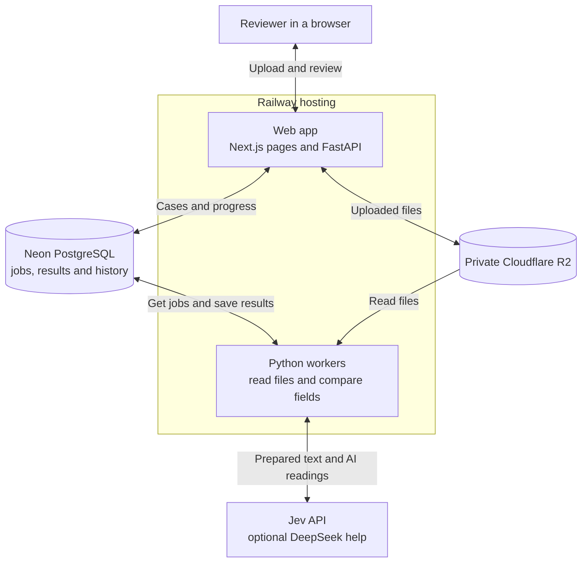
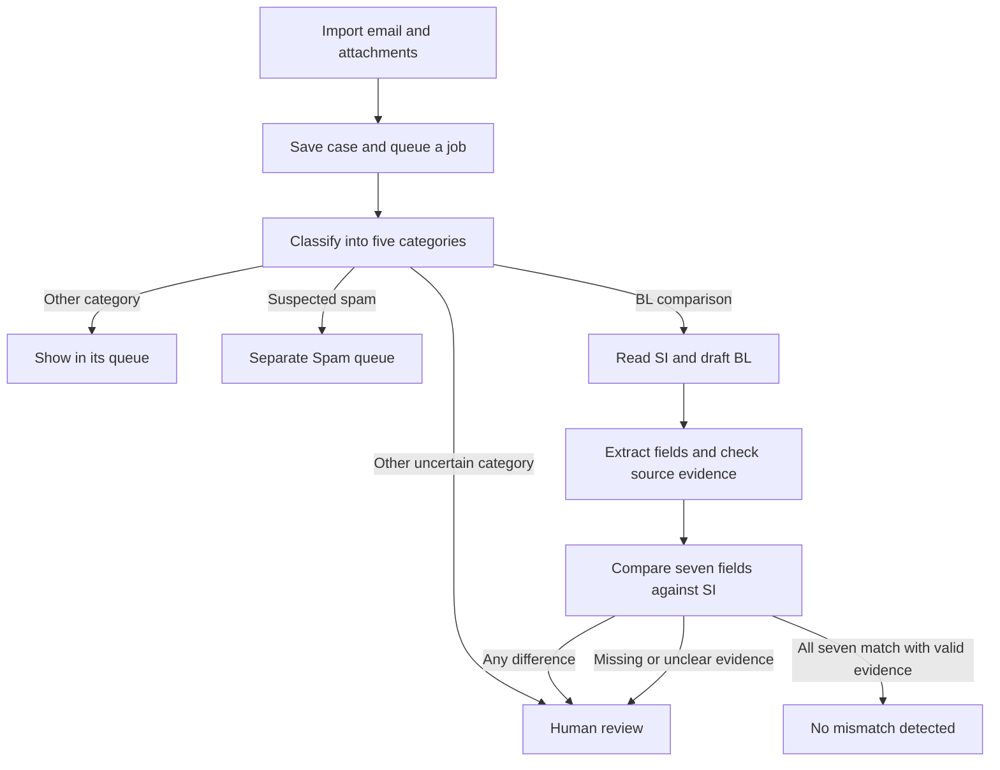
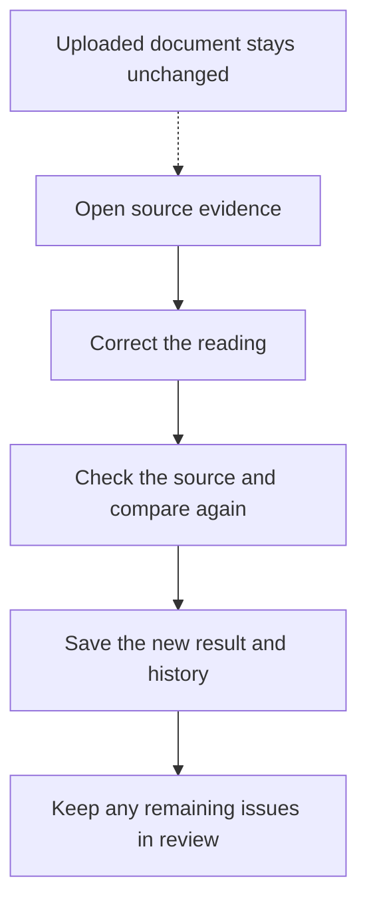
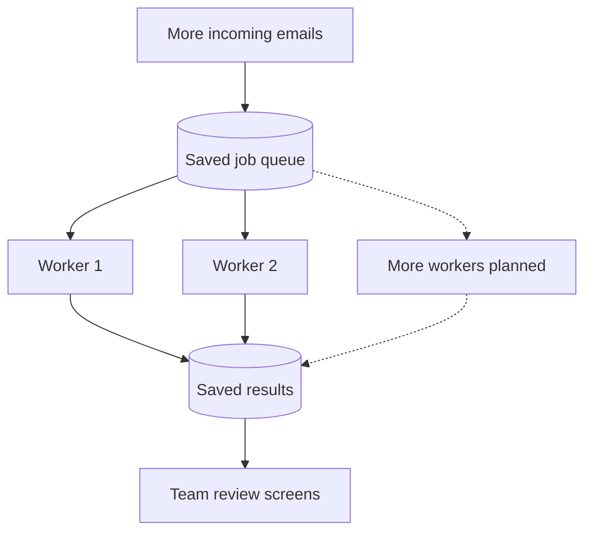

# Averis project document

**Team GoodLord | Monash Hackathon 2026**

Aung Phone Khant, Pei En, Congye and Ella

[Source code and setup](README.md) | [Live demo](https://averis-hackathon-production.up.railway.app/)

**Averis sorts shipping emails, checks seven shipment fields, and shows the
source behind every finding. People review differences and unclear readings.**

## Problem and users

Shipping teams receive emails with instructions, draft shipping documents,
questions and spam. Before a shipment moves forward, a reviewer must check that
the draft Bill of Lading (BL) agrees with the Shipping Instructions (SI).

A wrong party name, port, container count or weight can lead to more work and
shipment problems. Checking each field by hand also takes time. Averis helps
the reviewer find differences and see the evidence behind each result.

The intended product serves a shipping operations team working from a shared
email inbox. Reviewers check flagged cases, and a team lead sees work that still
needs attention. The prototype demonstrates this flow through manual imports,
separate demo workspaces and example reviewer identities. A live shared-mailbox
connection and real team accounts are planned next.

## Solution

Averis sorts emails into five categories: BL comparison, SI request, invoice
query, general and spam. Only BL comparison emails enter document checking.

For each comparison, the SI is the reference. Averis checks seven fields:

| Field | What it means |
| --- | --- |
| Shipper | The party sending the goods |
| Consignee | The party receiving the goods |
| Notify party | The party to contact about the shipment |
| Loading port | Where the goods are loaded |
| Discharge port | Where the goods are unloaded |
| Container count | The number of containers |
| Gross weight | The shipment weight, compared in kilograms |

The reviewer sees both values and the source text. Differences go to review
automatically. Missing or unclear evidence also goes to review. A person can
correct the app's reading and run the comparison again. The uploaded document
and earlier review history stay available.

### What works today

The live app accepts emails and attachments, sorts them, reads documents, checks
fields, and saves the results. Reviewers can open source evidence, correct a
reading, assign a case and see its history. Confirmed and suspected spam have
their own queue.

For example, a tested PDF case showed **15 containers in the SI and 16 in the
BL**, plus **359,415 kg in the SI and 360,415 kg in the BL**. The app highlighted
both differences and sent the case to review. The reviewer could open the
original files and the exact text behind each finding.

To explore the app, open the demo, choose **Enter demo workspace**, then open a
saved case and its source evidence. Saved demo cases are examples. New uploads
use the live processing service when AI processing and budget are available.

## Technical Architecture

Railway runs the web service and background workers. Neon stores case records
and jobs. Cloudflare R2 stores uploaded documents privately.

Workers are background programs. They call the AI service and run the document
readers and comparison code. The web app reads saved progress and results from
the database, so a long document check does not hold the page open waiting.

| Part | Why we use it |
| --- | --- |
| Next.js pages | Build the review screens as files served by FastAPI |
| FastAPI and Python | Handle browser requests and uploads, and share code with the workers |
| Private workers | Check documents in the background while people use the app |
| Neon PostgreSQL | Keeps jobs, cases, results and history after a service restart |
| Cloudflare R2 | Stores files privately, apart from case records |
| Document readers and OCR | Read file text directly, or use OCR to read text from scanned images |
| Jev through TypeSafe | Classifies emails and reads structured shipment fields from prepared text |
| Optional DeepSeek help | Helps read fields that the main reading path could not resolve |
| Docker and Railway | Package and run the web service and workers |

Workers check PostgreSQL for waiting jobs. The recorded deployment uses two workers in
Singapore, with one job per worker, close to the database.

## Implementation Details

### Email and document flow

The app reads TXT, PDF, DOCX and XLSX files, plus PNG and JPEG images. Tesseract
and RapidOCR read scanned text. Jev receives prepared text instead of raw files.
It suggests the email category and reads shipment fields. Optional DeepSeek
help is used for fields that remain unclear.

Python code checks that the selected text supports each reading and that the SI
and BL belong together. It then compares names, ports, numbers and units. AI
does not decide whether two numbers are equal. The original text and its location
stay linked to each reading.

### Correcting a reading

A reviewer can fix what the app read without changing the uploaded document.
For example, if OCR reads a digit incorrectly, the reviewer checks the source,
corrects the reading and sees an updated comparison.

### Keeping results safe to review

- All seven fields need valid matching evidence for an all-clear.
- High AI confidence alone is not enough to prove a match.
- Each finding keeps the file name, version, quoted text and location. Word
  documents use text locations instead of invented page numbers.
- New results must belong to the current document version. Old work cannot
  silently replace a newer review result.
- Workers save progress and take a job for a limited time. If a worker stops,
  the job can be recovered from saved progress.
- Spending is reserved before paid calls. An uncertain charge keeps its
  reservation until it can be resolved.
- Files are private and access is checked against the user's workspace.
- The supplied test answers are used only to score tests, never to decide the
  app's results.

### Code map

| Area | Source |
| --- | --- |
| API and access checks | [api.py](backend/src/averis/api.py), [routes.py](backend/src/averis/routes.py) |
| Email imports | [email_intake.py](backend/src/averis/email_intake.py), [bulk_ingest.py](backend/src/averis/bulk_ingest.py) |
| Jobs and recovery | [processing.py](backend/src/averis/processing.py), [runner.py](backend/src/averis/runner.py) |
| Readers and OCR | [documents/](backend/src/averis/documents/) |
| AI setup and adapters | [processing_setup.py](backend/src/averis/processing_setup.py), [jev.py](backend/src/averis/jev.py), [deepseek.py](backend/src/averis/deepseek.py) |
| Source checks and comparison | [verification.py](backend/src/averis/verification.py), [pairing.py](backend/src/averis/pairing.py), [case_status.py](backend/src/averis/case_status.py) |
| Corrections and history | [review.py](backend/src/averis/review.py), [workflow.py](backend/src/averis/workflow.py) |
| Records, files and spending | [persistence.py](backend/src/averis/persistence.py), [storage.py](backend/src/averis/storage.py), [budget.py](backend/src/averis/budget.py) |

Document readers and AI connections can be changed through code while the comparison rules
stay in place. Each change needs version updates and tests to check that earlier
cases still work.

## Validation and Results

### Measured results

Results below were measured at code version
[`68ffe2e`](https://github.com/Morris-Zin/Averis-Hackathon/commit/68ffe2eaf52b762b90df8232ae897f1d5758c4e4)
on 22 September 2026.

| Check | Result | Scope |
| --- | --- | --- |
| Organizer benchmark | 99.63/100 on 520 supplied emails | Official combined score using saved AI and OCR readings |
| Planted defect cases | 46/46 caught in the organizer evaluation | Known defects in the supplied test set |
| Check after the kg default change | Nine cases improved; the other 711 exported results stayed the same | 720 saved cases processed again to check for unwanted changes |
| Automated tests | 589 backend tests and 27 frontend tests passed; three backend tests skipped | Included the real PostgreSQL database, code checks, API data formats and app build |
| Live browser checks | Three imported cases completed on the first attempt | One matching case and two mismatch cases worked through the deployed flow |

The live cases checked the assumed-kg label, retained source evidence, results
and automatic review routing. The recorded
[CI run](https://github.com/Morris-Zin/Averis-Hackathon/actions/runs/35660169349)
also passed after seven extra controls were added.

The benchmark uses **saved AI and OCR readings from data already used during
development**. We ran those readings through the processing and export rules
again. The score combines complete-case results, email categories and defect
detection. It does not mean 99.63% accuracy on new shipments, and catching the
46 known defects does not guarantee catching every future error.

### Automated tests

- [Comparison checks](backend/tests/test_verification.py) cover field rules.
- [Review checks](backend/tests/test_domain_review.py) cover corrections.
- [Worker checks](backend/tests/test_runner.py) cover queued processing.
- [Budget checks](backend/tests/test_budget.py) cover spending controls.
- [Component checks](backend/tests/test_component_swaps.py) cover reader and AI changes.
- [Export checks](backend/tests/test_exporting.py) cover evaluation output rules.

Use the [README verification commands](README.md#run-the-checks) to run offline
checks. They do not call paid AI services.

## Challenges Faced

These changes came from our own use of the app and teammate testing. We have
not yet run a pilot with a shipping company.

### Long waits during testing

The team reported waits of around 15 minutes for some emails. We found database
delays and workers running far from the database. We improved job recovery,
moved workers from California to Singapore near the database, and added a second
worker. The same three-email test batch then fell from **293.3 seconds to 51.2
seconds**, with unchanged results. This small test does not establish speed
under heavy load.

### Documents looked clear to us but were hard for the reader

Teammates supplied Word files, PDFs and Chinese and Malay examples. A Word text
box was skipped, and PDF labels such as "Party to Notify" caused fields to be
grouped incorrectly. We improved those readers and kept the source locations.
The affected PDF went from **five unclear fields to seven matching fields** in a
live browser test. Chinese and Malay reading also improved, but difficult scans
and unclear document types still need review.

### A matching value did not always mean the case was ready

The team asked why a field could show high AI confidence but still need review.
A confident reading does not prove that the source is complete or that the SI
and BL belong together. We changed the messages to explain what still needs
checking. Matching colors now connect each mismatched SI/BL field pair to its
source text. The uploaded documents stay unchanged.

### Suspected spam was adding work to the shipment queue

The team objected to suspected spam filling the shipment review queue. We added
a separate Spam view with a clear "Suspected" label. "Not spam" returns a message
to category review and keeps its earlier suggestion and history. Browser tests
confirmed that the choice stays saved after refresh. This improves how work is
sorted; it does not prove general phishing detection.

### Different names for the same port

Short port names and names with countries or codes caused false warnings. We
added the UN/LOCODE location-code directory to check each value. Rechecking 720
saved emails removed **three false port warnings** without changing other
measured results. Name coverage is still incomplete: Goteborg and Göteborg are
recognized, but Gothenburg is not yet a verified alternative. Unclear names
stay in review instead of being forced to match.

### Deciding what a weight without a unit means

Some spreadsheets had "GROSS WEIGHT" and a number without a unit. Our strict
rule left them unclear. We chose a visible business rule: a complete weight
without a unit defaults to kilograms in each document. Explicit units are still
converted, and conflicting units need review. **Nine saved cases improved; the
other 711 exported results stayed unchanged.** An unlabeled pounds value can
still be read as kilograms, so the app shows the assumption.

### Keeping access to earlier uploads

The team reported missing earlier uploads and expected to see each other's
cases. We found separate demo workspaces with 24-hour expiry and cleanup. This
did not explain every reported refresh issue, but it made longer testing hard.
We removed automatic expiry and cleanup. A live test retained **18 earlier
cases** in the same browser session. Shared team access is still planned;
clearing browser cookies can still remove access, and deleted data cannot be
recovered automatically.

## Practical Value and Difference

Averis brings email sorting, document comparison and source evidence into the
same review flow. The reviewer can see why a field was flagged and correct the
reading without losing the uploaded file or earlier result.

The key design choice is to keep the evidence, comparison and correction steps
together. A reviewer can follow a warning back to the document and fix a reading
in the same screen. The system keeps both known differences and unanswered
questions visible. This makes the result easier to check and act on.

| User need | How Averis helps |
| --- | --- |
| Find the emails that need attention | Separate email categories, shipment review and spam queues |
| Understand a warning | Show SI and BL values beside their source text |
| Fix a wrong reading | Recheck the result and keep the earlier history |
| Improve reading over time | Replace document readers or AI connections while keeping the comparison rules |

The expected value is less routine checking and quicker investigation of errors.
We have not yet measured staff time saved or financial savings with a shipping
company. Those measurements are part of the next stage.

## Scalability

Averis separates the web app from document processing. The web app saves each
job in PostgreSQL, and private workers process jobs in the background. This lets
people keep using the review pages while documents are being checked.

The recorded deployment uses two workers, with one job per worker. A database
record marks who is working on each job. Saved progress helps interrupted work
resume. Uploaded files stay in R2, so workers do not depend on files stored on
one server. Case lists use pages of short summaries; full evidence is loaded
when a reviewer opens a case.

The next step is to add workers when more emails arrive, within the database,
AI service and spending limits:

To support more emails and teams, we plan to:

- Bring connected inboxes into shared team workspaces, with access rules that
  keep each team's emails and documents separate.
- Monitor queue length, waiting time, processing time, failed jobs and cost per email.

Before increasing capacity, we will test larger email batches and several users
working at once. We will check that jobs finish without duplicate results, review
changes stay saved, and spending remains within limits. Automatic worker scaling
and performance under heavy load have not yet been verified. Adding workers
alone does not guarantee faster processing if the database or AI service is busy.

## Future Roadmap

These are planned steps, not completed features.

| Stage | Next work | How we will check progress |
| --- | --- | --- |
| Before a customer pilot | Test fresh, unseen documents and difficult scans | Report correct results, missed defects, false alarms and review rate separately |
| Small shipping-team pilot | Add real user accounts, team roles and agreed data retention | Check access rules and observe reviewers completing real tasks |
| Combined team inbox | Bring connected mailboxes into one shared workspace with case assignment and shared progress | Two teammates see the same emails and saved changes; repeat imports create no duplicate cases; other teams cannot access them |
| Daily email use | Keep mailbox updates in sync and show clear retry messages | Check that new emails arrive automatically, each email is handled once and failed imports can recover |
| Better document reading | Improve hard layouts and language coverage | Compare readers on the same fixed tests and a fresh test set |
| More users and jobs | Load tests, monitoring and worker capacity planning | Measure queue time, completion time, failure rate and cost per email |
| Product value | Measure manual work before and after the pilot | Track review time, corrections and missed issues with the shipping team |
