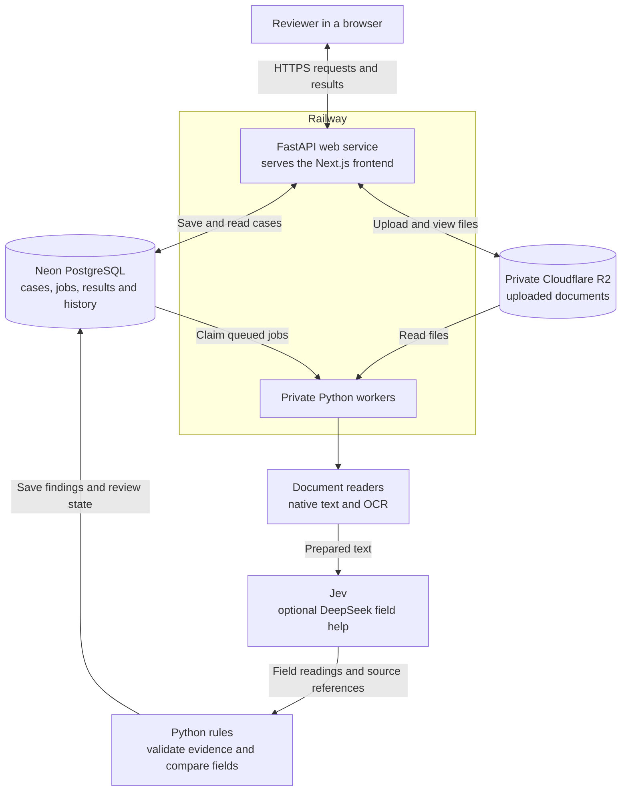
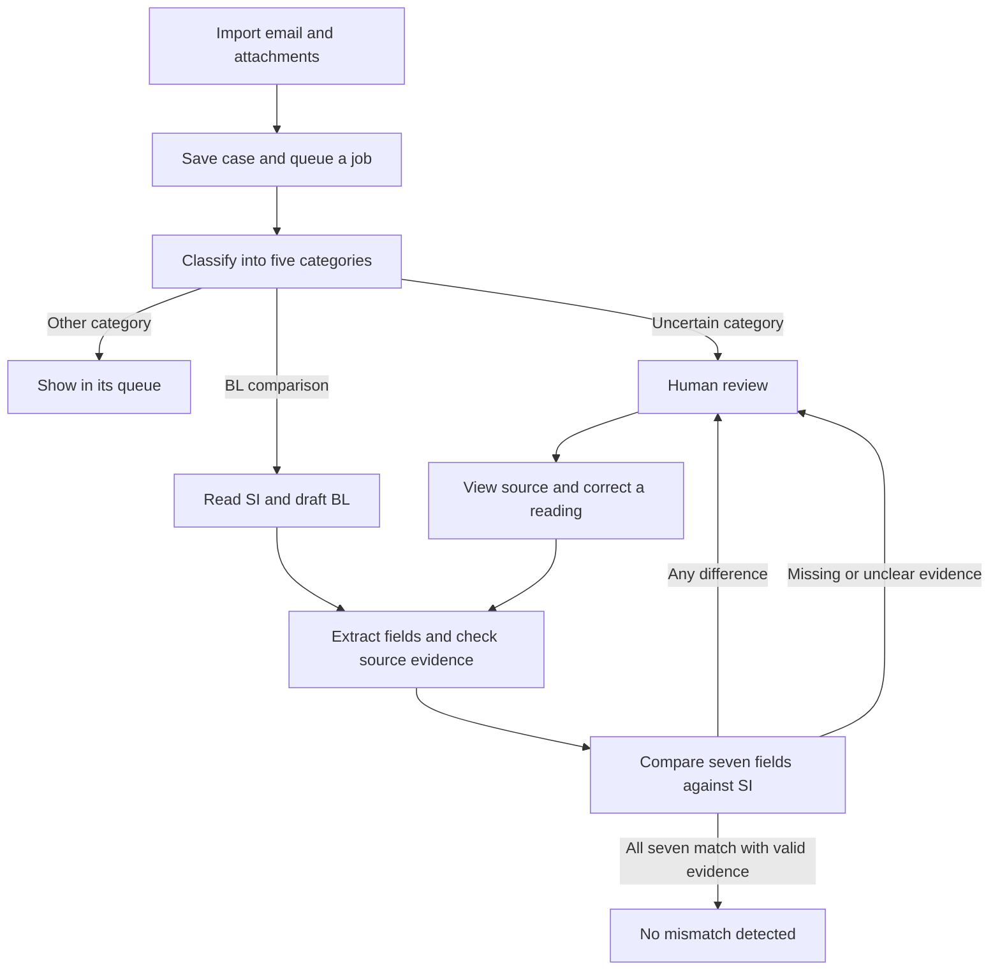

# Averis project document

**Team GoodLord | Monash Hackathon 2026**

Aung Phone Khant, Pei En, Congye and Ella

[Source code and setup](README.md) | [Live demo](https://averis-hackathon-production.up.railway.app/)

## Problem and users

Shipping teams receive emails with instructions, draft shipping documents,
questions and spam. Before a shipment moves forward, a reviewer must check that
the draft Bill of Lading (BL) agrees with the Shipping Instructions (SI).

A wrong party name, port, container count or weight can lead to more work and
shipment problems. Checking each field by hand also takes time. Averis helps
the reviewer find differences and see the evidence behind each result.

The main users are shipping operations staff and document reviewers. A team
lead can use the queue to see cases that need attention. The prototype uses
demo workspaces and example reviewer identities.

## Solution

Averis sorts emails into five categories: BL comparison, SI request, invoice
query, general and spam. Only BL comparison emails enter document checking.

For each comparison, the SI is the reference. Averis checks seven fields:

| Field | What it means |
| --- | --- |
| Shipper | The party sending the goods |
| Consignee | The party receiving the goods |
| Notify party | The party to contact about the shipment |
| Loading port | Where the goods are loaded |
| Discharge port | Where the goods are unloaded |
| Container count | The number of containers |
| Gross weight | The shipment weight, compared in kilograms |

The reviewer sees both values and the source text. Differences go to review
automatically. Missing or unclear evidence also goes to review. A person can
correct the app's reading and run the comparison again. The uploaded document
and earlier review history stay available.

## Technical Architecture

This diagram follows the stack in our demo slides and adds the data flow.
It shows the Railway deployment. R2 means **Cloudflare R2**, our private file
storage service.

The reading, AI and comparison steps run inside the worker process. They are
shown separately to explain their jobs. Email classification happens before
attachment processing. The API returns saved progress and results to the browser.

| Part | Why we use it |
| --- | --- |
| Next.js static frontend | Builds the review pages into files that FastAPI can serve |
| FastAPI and Python | Handles uploads and API requests, and shares Python code with the worker |
| Private workers | Process documents without holding a browser request open |
| Neon PostgreSQL | Keeps jobs, cases, results and history after a service restart |
| Cloudflare R2 | Stores files privately, apart from case records |
| Native parsers and OCR | Read editable documents and scanned pages |
| Jev through TypeSafe | Classifies emails and reads structured shipment fields from prepared text |
| Optional DeepSeek adapter | Helps with fields that the main reading path could not resolve |
| Docker and Railway | Package and run the web service and workers |

Workers poll PostgreSQL for jobs. The recorded deployment uses two workers in
Singapore, with one job per worker, close to the database. The code supports
Google Cloud Tasks too, but that is not the queue used on Railway. Railway
service settings control deployment; `infra/railway/` holds reference settings.

## Implementation Details

### Email and document flow

The flow below is redrawn from slide 4 of our demo pitch.

1. **Import.** A user adds an email and files, or imports a ZIP. The app checks
   file limits and detects repeat submissions in the same workspace.
2. **Classify.** Jev suggests one of five categories. The app keeps uncertain
   choices for review. A suggestion is not always an accepted decision.
3. **Read.** Native readers handle TXT, PDF, DOCX and XLSX. Scans and images use
   Tesseract or RapidOCR. Jev receives prepared text, not raw PDF or image files.
4. **Pair.** The app checks that the SI and BL belong together. Conflicting or
   unclear shipment references stop the case from receiving an all-clear.
5. **Extract.** AI readings retain source text and locations. The code checks
   that the evidence supports the selected values.
6. **Compare.** Python rules handle names, ports, numbers and units. AI does not
   make the final numeric comparison. A complete weight with no unit defaults
   to kilograms, and the app records and shows that assumption.
7. **Review.** Differences and unclear fields remain visible together. Correcting
   a reading creates history and updates the comparison without editing the file.

### Keeping results safe to review

- All seven fields need valid matching evidence for an all-clear.
- High AI confidence alone is not enough to prove a match.
- A source reference keeps the document identity, version, quoted text and a
  useful location. Word documents are not given invented page numbers.
- New results must belong to the current document version. Old work cannot
  silently replace a newer review result.
- Jobs use saved checkpoints and timed claims so interrupted work can recover.
- Spending is reserved before paid calls. An uncertain charge keeps its
  reservation until it can be resolved.
- Files are private and access is checked against the user's workspace.
- Organizer answer labels are kept outside runtime inference.

### Code map

| Area | Source |
| --- | --- |
| API and access checks | [api.py](backend/src/averis/api.py), [routes.py](backend/src/averis/routes.py) |
| Email imports | [email_intake.py](backend/src/averis/email_intake.py), [bulk_ingest.py](backend/src/averis/bulk_ingest.py) |
| Jobs and recovery | [processing.py](backend/src/averis/processing.py), [runner.py](backend/src/averis/runner.py) |
| Readers and OCR | [documents/](backend/src/averis/documents/) |
| AI setup and adapters | [processing_setup.py](backend/src/averis/processing_setup.py), [jev.py](backend/src/averis/jev.py), [deepseek.py](backend/src/averis/deepseek.py) |
| Source checks and comparison | [verification.py](backend/src/averis/verification.py), [pairing.py](backend/src/averis/pairing.py), [case_status.py](backend/src/averis/case_status.py) |
| Corrections and history | [review.py](backend/src/averis/review.py), [workflow.py](backend/src/averis/workflow.py) |
| Records, files and spending | [persistence.py](backend/src/averis/persistence.py), [storage.py](backend/src/averis/storage.py), [budget.py](backend/src/averis/budget.py) |

Readers and AI adapters can be changed through code while the comparison rules
stay in place. Each change needs version updates and regression checks. This is
not yet a user-facing plugin store.

## Validation and Results

### Recorded checkpoint: 22 September 2026

These results come from the saved verification report for code checkpoint
[`68ffe2e`](https://github.com/Morris-Zin/Averis-Hackathon/commit/68ffe2eaf52b762b90df8232ae897f1d5758c4e4).
They describe that checkpoint, not a fresh test of every later commit.

| Check | Recorded result | What it proves and what it does not |
| --- | --- | --- |
| Organizer benchmark | 99.63/100 on 520 supplied emails | The official weighted score on saved development outputs; not accuracy on new shipments |
| Planted defect cases | 46/46 caught in the organizer evaluation | Coverage of known test defects; not a promise to catch every future error |
| Replay after the kg default change | Nine cases improved; the other 711 exports stayed the same | A regression check across 720 saved cases |
| Full automated verification | 589 backend tests and 27 frontend tests passed; three backend tests skipped | Recorded checks included PostgreSQL, types, lint, API contracts and build |
| Live browser checks | Three imported cases completed on the first attempt | One matching case and two mismatch cases worked through the deployed flow |

The live cases checked the assumed-kg label, retained source evidence, results
and automatic review routing. The recorded
[CI run](https://github.com/Morris-Zin/Averis-Hackathon/actions/runs/35660169349)
also passed after seven extra controls were added.

The score uses **saved AI and OCR results on data already used during development**.
It checks processing and export rules without fresh AI calls. It is not an
independent test or the 100-point hackathon judging score. The official scorer
combines end-to-end results, classification and defect scores. It must not be
described as 99.63% real-world accuracy.

### Checks a judge can inspect or run

- [Comparison checks](backend/tests/test_verification.py) cover field rules.
- [Review checks](backend/tests/test_domain_review.py) cover corrections.
- [Worker checks](backend/tests/test_runner.py) cover queued processing.
- [Budget checks](backend/tests/test_budget.py) cover spending controls.
- [Component checks](backend/tests/test_component_swaps.py) cover reader and AI changes.
- [Export checks](backend/tests/test_exporting.py) cover evaluation output rules.

Use the [README verification commands](README.md#run-the-checks) to run offline
checks. They do not call paid AI services. The results above were read from the
saved checkpoint report. This document update did not rerun the full benchmark
or paid browser tests.

## Challenges Faced

| Challenge | What we built or changed | What still needs care |
| --- | --- | --- |
| Many document formats | Native readers plus OCR for scans | Complex layouts and poor scans can still need review |
| Word tables and text boxes | Reading rules that keep structure and source text | Unsupported structures remain uncertain |
| Chinese and Malay documents | Language support in readers and OCR | Broader real customer documents still need testing |
| Similar shipment references | Pairing checks before comparing fields | Unclear pairs still need a reviewer |
| Missing weight units | A visible kg default for complete numbers | An unlabeled pounds value can be read as kg |
| A mismatch beside an unknown field | Keep both findings and send the case to review | A reviewer still needs to settle the unknown field |
| Slow or interrupted jobs | Background workers, checkpoints and recovery | Larger load tests and monitoring are still needed |
| AI cost and failed calls | Shared spending records and reservations | Paid usage needs correct prices and ongoing oversight |

We moved workers closer to the database too. In a recorded test using the same
three emails, total batch time fell from 293.3 seconds to 51.2 seconds after the
combined recovery, location and worker changes. This was a small test, not a
guarantee of speed under heavy load.

## Practical Value and Difference

Averis brings email sorting, document comparison and source evidence into the
same review flow. The reviewer can see why a field was flagged and correct the
reading without losing the uploaded file or earlier result.

The useful difference is the link between AI readings, fixed comparison rules
and human review. An unclear value stays unclear. A known difference stays
visible. Better readers can be added without replacing the review process.

The expected value is less routine checking and quicker investigation of errors.
We have not yet measured staff time saved or financial savings with a shipping
company. Those measurements are part of the next stage.

## Future Roadmap

These are planned steps, not completed features.

| Stage | Next work | How we will check progress |
| --- | --- | --- |
| Before a customer pilot | Test fresh, unseen documents and difficult scans | Report correct results, missed defects, false alarms and review rate separately |
| Small shipping-team pilot | Add real user accounts, team roles and agreed data retention | Check access rules and observe reviewers completing real tasks |
| Daily email use | Add mailbox connections and clear retry messages | Check that each email is handled once and failures can recover |
| Better document reading | Improve hard layouts and language coverage | Compare readers on the same fixed tests and a fresh test set |
| More users and jobs | Load tests, monitoring and worker capacity planning | Measure queue time, completion time, failure rate and cost per email |
| Product value | Measure manual work before and after the pilot | Track review time, corrections and missed issues with the shipping team |

## Rubric Coverage

This table points to evidence. It does not predict a judge's score.

| Criterion | Points | Where to look |
| --- | --- | --- |
| System Design and Architecture | 15 | Architecture diagram, component reasons and code links |
| Working Core Prototype | 25 | Live demo, import-to-review flow and recorded browser checks |
| Technology Integration | 15 | Readers, AI adapters, Python rules, PostgreSQL jobs and private R2 files |
| Technical Feasibility and Validation | 15 | Checkpoint results, executable tests, limits and roadmap |
| Problem Statement Understanding | 10 | Shipping users, SI as reference and the seven required fields |
| Innovation and Solution Approach | 10 | Evidence-linked findings, visible uncertainty and corrections with history |
| Practical Value and Potential | 10 | Reviewer workflow and a pilot plan with measurable outcomes |

## Submission links

- **GitHub Repository Link:** [Averis source code and README](https://github.com/Morris-Zin/Averis-Hackathon)
- **Slide Deck / Documentation Link:** [Averis project document](https://github.com/Morris-Zin/Averis-Hackathon/blob/main/PROJECT.md)

The project document covers all four required topics: Technical Architecture,
Implementation Details, Challenges Faced and Future Roadmap.
