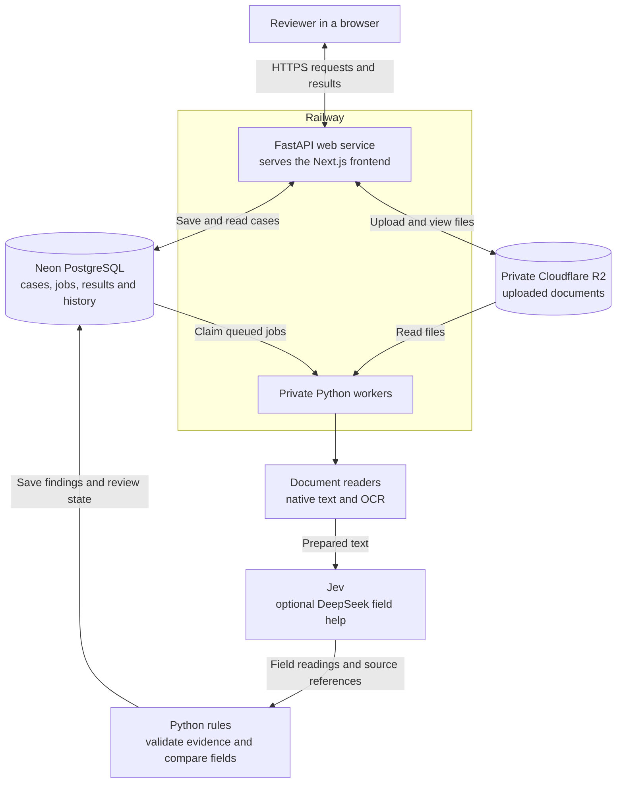
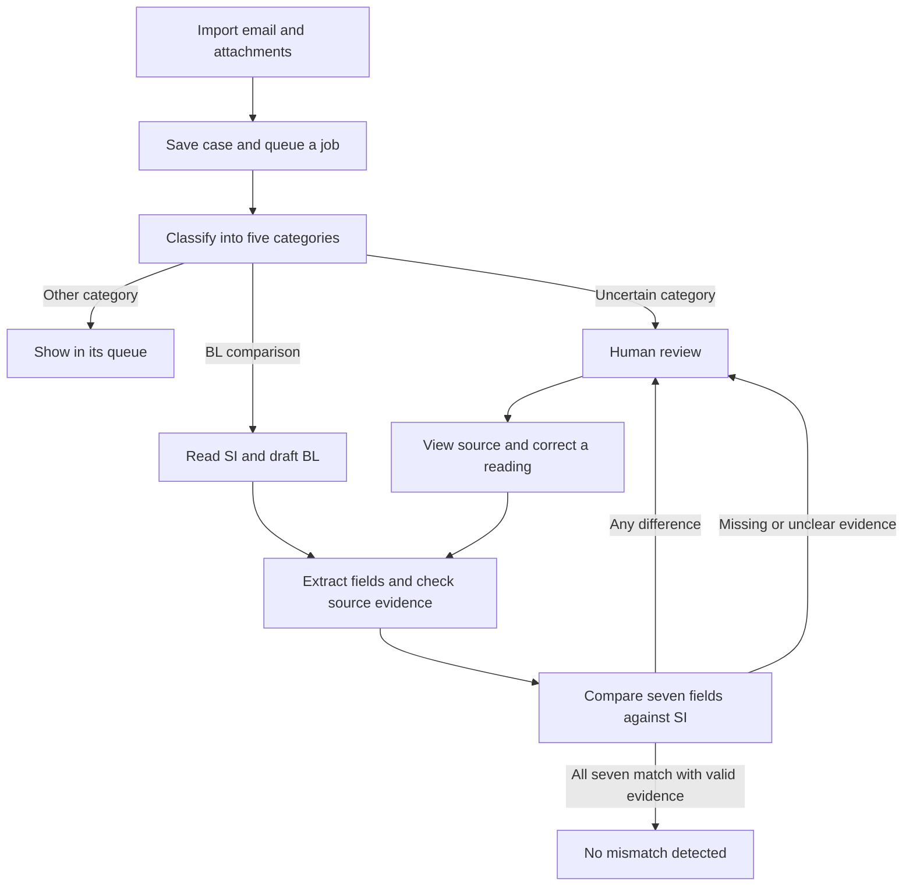

# Averis project document

**Team GoodLord | Monash Hackathon 2026**

Aung Phone Khant, Pei En, Congye and Ella

[Source code and setup](README.md) | [Live demo](https://averis-hackathon-production.up.railway.app/)

## Problem and users

Shipping teams receive emails with instructions, draft shipping documents,
questions and spam. Before a shipment moves forward, a reviewer must check that
the draft Bill of Lading (BL) agrees with the Shipping Instructions (SI).

A wrong party name, port, container count or weight can lead to more work and
shipment problems. Checking each field by hand also takes time. Averis helps
the reviewer find differences and see the evidence behind each result.

The intended product serves a shipping operations team working from a shared
email inbox. Reviewers check flagged cases, and a team lead sees work that still
needs attention. The prototype demonstrates this flow through manual imports,
separate demo workspaces and example reviewer identities. A live shared-mailbox
connection and real team accounts are planned next.

## Solution

Averis sorts emails into five categories: BL comparison, SI request, invoice
query, general and spam. Only BL comparison emails enter document checking.

For each comparison, the SI is the reference. Averis checks seven fields:

| Field | What it means |
| --- | --- |
| Shipper | The party sending the goods |
| Consignee | The party receiving the goods |
| Notify party | The party to contact about the shipment |
| Loading port | Where the goods are loaded |
| Discharge port | Where the goods are unloaded |
| Container count | The number of containers |
| Gross weight | The shipment weight, compared in kilograms |

The reviewer sees both values and the source text. Differences go to review
automatically. Missing or unclear evidence also goes to review. A person can
correct the app's reading and run the comparison again. The uploaded document
and earlier review history stay available.

## Technical Architecture

Railway runs the web service and background workers. Neon stores case records
and jobs. Cloudflare R2 stores uploaded documents privately.

The reading, AI and comparison steps run inside the worker process. They are
shown separately to explain their jobs. Email classification happens before
attachment processing. The API returns saved progress and results to the browser.

| Part | Why we use it |
| --- | --- |
| Next.js static frontend | Builds the review pages into files that FastAPI can serve |
| FastAPI and Python | Handles uploads and API requests, and shares Python code with the worker |
| Private workers | Process documents without holding a browser request open |
| Neon PostgreSQL | Keeps jobs, cases, results and history after a service restart |
| Cloudflare R2 | Stores files privately, apart from case records |
| Native parsers and OCR | Read editable documents and scanned pages |
| Jev through TypeSafe | Classifies emails and reads structured shipment fields from prepared text |
| Optional DeepSeek adapter | Helps with fields that the main reading path could not resolve |
| Docker and Railway | Package and run the web service and workers |

Workers poll PostgreSQL for jobs. The recorded deployment uses two workers in
Singapore, with one job per worker, close to the database.

## Implementation Details

### Email and document flow

1. **Import.** A user adds an email and files, or imports a ZIP. The app checks
   file limits and detects repeat submissions in the same workspace.
2. **Classify.** Jev suggests one of five categories. The app keeps uncertain
   choices for review. A suggestion is not always an accepted decision.
3. **Read.** Native readers handle TXT, PDF, DOCX and XLSX. Scans and images use
   Tesseract or RapidOCR. Jev receives prepared text, not raw PDF or image files.
4. **Pair.** The app checks that the SI and BL belong together. Conflicting or
   unclear shipment references stop the case from receiving an all-clear.
5. **Extract.** AI readings retain source text and locations. The code checks
   that the evidence supports the selected values.
6. **Compare.** Python rules handle names, ports, numbers and units. AI does not
   make the final numeric comparison. A complete weight with no unit defaults
   to kilograms, and the app records and shows that assumption.
7. **Review.** Differences and unclear fields remain visible together. Correcting
   a reading creates history and updates the comparison without editing the file.

### Keeping results safe to review

- All seven fields need valid matching evidence for an all-clear.
- High AI confidence alone is not enough to prove a match.
- A source reference keeps the document identity, version, quoted text and a
  useful location. Word documents are not given invented page numbers.
- New results must belong to the current document version. Old work cannot
  silently replace a newer review result.
- Jobs use saved checkpoints and timed claims so interrupted work can recover.
- Spending is reserved before paid calls. An uncertain charge keeps its
  reservation until it can be resolved.
- Files are private and access is checked against the user's workspace.
- Organizer answer labels are kept outside runtime inference.

### Code map

| Area | Source |
| --- | --- |
| API and access checks | [api.py](backend/src/averis/api.py), [routes.py](backend/src/averis/routes.py) |
| Email imports | [email_intake.py](backend/src/averis/email_intake.py), [bulk_ingest.py](backend/src/averis/bulk_ingest.py) |
| Jobs and recovery | [processing.py](backend/src/averis/processing.py), [runner.py](backend/src/averis/runner.py) |
| Readers and OCR | [documents/](backend/src/averis/documents/) |
| AI setup and adapters | [processing_setup.py](backend/src/averis/processing_setup.py), [jev.py](backend/src/averis/jev.py), [deepseek.py](backend/src/averis/deepseek.py) |
| Source checks and comparison | [verification.py](backend/src/averis/verification.py), [pairing.py](backend/src/averis/pairing.py), [case_status.py](backend/src/averis/case_status.py) |
| Corrections and history | [review.py](backend/src/averis/review.py), [workflow.py](backend/src/averis/workflow.py) |
| Records, files and spending | [persistence.py](backend/src/averis/persistence.py), [storage.py](backend/src/averis/storage.py), [budget.py](backend/src/averis/budget.py) |

Readers and AI adapters can be changed through code while the comparison rules
stay in place. Each change needs version updates and tests to check that earlier
cases still work.

## Validation and Results

### Recorded checkpoint: 22 September 2026

Results below were measured at code version
[`68ffe2e`](https://github.com/Morris-Zin/Averis-Hackathon/commit/68ffe2eaf52b762b90df8232ae897f1d5758c4e4).
on 22 September 2026.

| Check | Recorded result | What it proves and what it does not |
| --- | --- | --- |
| Organizer benchmark | 99.63/100 on 520 supplied emails | The official weighted score on saved development outputs; not accuracy on new shipments |
| Planted defect cases | 46/46 caught in the organizer evaluation | Coverage of known test defects; not a promise to catch every future error |
| Replay after the kg default change | Nine cases improved; the other 711 exports stayed the same | A regression check across 720 saved cases |
| Full automated verification | 589 backend tests and 27 frontend tests passed; three backend tests skipped | Recorded checks included PostgreSQL, types, lint, API contracts and build |
| Live browser checks | Three imported cases completed on the first attempt | One matching case and two mismatch cases worked through the deployed flow |

The live cases checked the assumed-kg label, retained source evidence, results
and automatic review routing. The recorded
[CI run](https://github.com/Morris-Zin/Averis-Hackathon/actions/runs/35660169349)
also passed after seven extra controls were added.

The score uses **saved AI and OCR results on data already used during development**.
It checks processing and export rules without fresh AI calls. It is not an
independent test of new shipments. The official scorer combines complete-case
results, classification and defect scores.

### Automated tests

- [Comparison checks](backend/tests/test_verification.py) cover field rules.
- [Review checks](backend/tests/test_domain_review.py) cover corrections.
- [Worker checks](backend/tests/test_runner.py) cover queued processing.
- [Budget checks](backend/tests/test_budget.py) cover spending controls.
- [Component checks](backend/tests/test_component_swaps.py) cover reader and AI changes.
- [Export checks](backend/tests/test_exporting.py) cover evaluation output rules.

Use the [README verification commands](README.md#run-the-checks) to run offline
checks. They do not call paid AI services.

## Challenges Faced

### Long waits during testing

During team testing, some emails appeared to take around 15 minutes to finish.
We investigated the whole job flow and found delays from database locking,
workers far from the database, and repeated loading of libraries that document
readers did not need.

We improved job recovery, moved workers from California to Singapore near the
database, added a second worker, and removed unnecessary library loading. In a
controlled test with the same three emails, completion time fell from 293.3
seconds to 51.2 seconds with the same results. This was a small test; larger
loads still need measurement.

### Documents looked clear to us but were hard for the reader

Teammates supplied Word files, PDFs and Chinese and Malay examples that exposed
gaps in reading. One Word file placed important fields in a text box that the
reader skipped. A PDF used labels such as "Party to Notify" that caused separate
fields to be grouped together.

We added support for those Word structures and field labels while keeping the
source locations. The affected PDF went from five unclear fields to seven
matching fields in a live browser test. We also improved Chinese and Malay
reading. Difficult scans and unclear document roles still go to review.

### A matching value did not always mean the case was ready

Team testing raised a confusing question: why could a field look correct and
show high AI confidence, yet still need review? We found that confidence in a
selected value was different from proof that the source was complete or that
the two documents belonged together.

We made the messages explain that difference. We also added a shared color to
each mismatched SI/BL field pair and its extracted evidence, so reviewers can
follow the finding. Known mismatches stay visible beside unclear fields. The
colors mark extracted text; they do not alter the uploaded documents.

### Suspected spam was adding work to the shipment queue

Our first flow sent uncertain spam into the same review queue as shipment
problems. During testing, we saw that this made reviewers spend attention on
messages unrelated to checking documents.

We added a separate Spam view for confirmed and suspected spam, with a clear
"Suspected" label. "Not spam" returns a message to category review and keeps its
earlier suggestion and history. Browser tests confirmed that this choice stays
saved after refresh. This improves the queue; it is not a claim of reliable
phishing detection.

### Different names for the same port

We found false warnings when one document used a short port name and the other
included a country or port code. We added a fixed UN/LOCODE directory and resolve
each value against it before comparison. A replay of 720 saved emails removed
three false port warnings without changing other measured results.

We still leave unclear names for review. For example, our directory recognizes
Goteborg and Göteborg, but does not yet have a verified Gothenburg alias. A
similar spelling alone is not enough to prove that two ports are the same.

### Deciding what a weight without a unit means

Some supplied spreadsheets had a "GROSS WEIGHT" label and a number, but no unit.
Our strict rule left these values unclear, including cases with other known
differences. We chose an explicit business rule: a complete weight with no unit
defaults to kilograms, independently in each document.

The app records and shows this assumption. Explicit units are still converted,
and conflicting units remain in review. The change improved nine saved cases
while the other 711 exports stayed unchanged. An unlabeled pounds value can
still be read as kilograms, so the assumption must remain visible.

### Keeping access to earlier uploads

During testing, earlier uploads appeared to disappear, and teammates expected
to see each other's cases. We found that demo workspaces were separate and had
a 24-hour expiry with automatic cleanup. This did not prove the cause of every
reported refresh issue, but it made longer testing difficult.

We removed automatic expiry and cleanup, and kept access through the existing
browser session. Live testing confirmed that the same session retained 18
earlier audit cases. Workspaces remain separate until shared team accounts are
added. Clearing a browser cookie can still remove access, and previously deleted
data cannot be recovered automatically.

## Practical Value and Difference

Averis brings email sorting, document comparison and source evidence into the
same review flow. The reviewer can see why a field was flagged and correct the
reading without losing the uploaded file or earlier result.

The useful difference is the link between AI readings, fixed comparison rules
and human review. An unclear value stays unclear. A known difference stays
visible. Better readers can be added without replacing the review process.

The expected value is less routine checking and quicker investigation of errors.
We have not yet measured staff time saved or financial savings with a shipping
company. Those measurements are part of the next stage.

## Future Roadmap

These are planned steps, not completed features.

| Stage | Next work | How we will check progress |
| --- | --- | --- |
| Before a customer pilot | Test fresh, unseen documents and difficult scans | Report correct results, missed defects, false alarms and review rate separately |
| Small shipping-team pilot | Add real user accounts, team roles and agreed data retention | Check access rules and observe reviewers completing real tasks |
| Combined team inbox | Connect the team's shared mailbox and bring emails from connected inboxes into one team workspace. Let teammates see the same emails, assign cases and share review progress | Test with two team members: both see the same incoming email, assignments and saved changes. Check that repeat imports do not create duplicate cases and access stays within the team |
| Daily email use | Keep mailbox updates in sync and show clear retry messages | Check that new emails arrive automatically, each email is handled once and failed imports can recover |
| Better document reading | Improve hard layouts and language coverage | Compare readers on the same fixed tests and a fresh test set |
| More users and jobs | Load tests, monitoring and worker capacity planning | Measure queue time, completion time, failure rate and cost per email |
| Product value | Measure manual work before and after the pilot | Track review time, corrections and missed issues with the shipping team |
