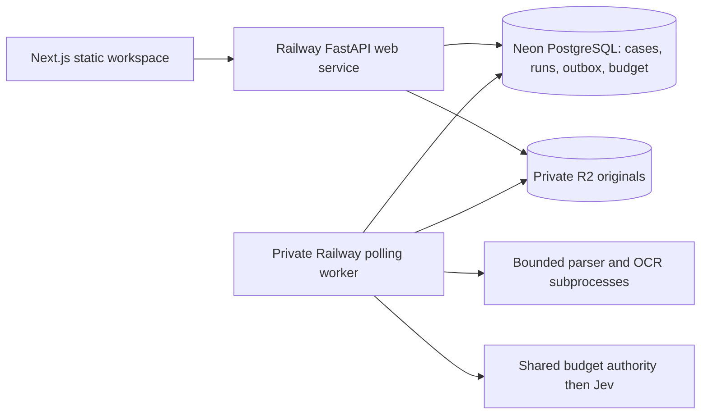
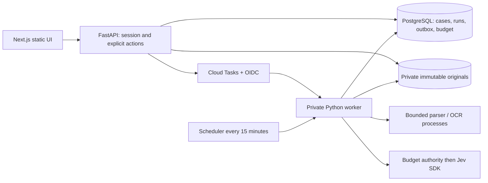

# Averis architecture and delivery

## Deployment decision update — 20 September 2026

The user delegated hosting selection after Google Cloud billing blocked deployment. Railway is selected for the public container and a private background process, while Neon and R2 remain unchanged. Both services are deployed at https://averis-hackathon-production.up.railway.app/ with a private polling worker and server-side credentials. The worker reuses the existing Processor leases, checkpoints, budget authority and revision fencing. Two live comparisons passed, including automatic browser progress updates. Railway runs one replica per service and one processing slot; its trial credit is finite. The Cloud Run/Tasks configuration below remains a validated local alternative, not deployed infrastructure.

## Live deployment

The worker has no public domain. It polls durable eligible runs and periodically reconciles missed delivery and expired leases; SQL leases and attempt tokens coordinate work. The web service serves static assets and API under one HTTPS origin.

## Original accepted architecture

The accepted stack is Next.js/TypeScript static export, FastAPI/Python, PostgreSQL (Neon), private R2 Standard storage and durable Google Cloud Tasks delivery. Everything lives in one monorepo. FastAPI serves the built frontend and API from the same origin; the private Cloud Run worker uses the same Python package.

The review route is `/review?case=<id>`. Cases created after the frontend build are loaded through the API. Cloud Run uses request-based billing with minimum zero instances; worker maximum two instances with one request each; task concurrency two. These are resource controls, not measured enterprise capacity.

## Deep modules and contracts

| Capability | Owner | Hidden decisions |
|---|---|---|
| Import an email | Intake | Deduplication, workspace locking, original storage, atomic case/run/outbox persistence and rollback cleanup |
| Classify and extract candidate evidence | Intelligence | Provider SDK, prompts, distribution validation, confidence policy |
| Read documents and render evidence | Documents | Format-specific parsers, OCR, resource bounds, coordinates |
| Verify SI against BL | Verification | Pair references, normalization, explicit units, missing values, seven-field outcomes |
| Apply reviewer actions | Workflow | Source-bound corrections, accepted categories/pairs, versions, optimistic conflicts |
| Schedule and execute processing | Processing | Transactional outbox, attempts, leases, checkpoints, recovery, stale-run fencing |
| Authorize access and store originals | API/session and storage adapters | Opaque sessions, CSRF/origin checks, workspace scope, server-controlled keys |

Public Pydantic contracts generate frontend types through OpenAPI. The frontend presents decisions and submits explicit actions; it does not parse shipment values or compare normalized fields. Boundary checks prevent pure domain rules from depending on HTTP, persistence or inference infrastructure.

Classification, technical processing, comparison findings and employee workflow are distinct. A completed review does not erase discrepancies. Missing values are unknown, never zero. Only a valid pair with all seven reliable matches and no blockers can be presented as clear.

## Evidence and revisions

TXT retains line positions; PDF retains pages and regions; DOCX uses a labelled structured reading-order preview; XLSX retains sheets/cells. OCR is English-first. Original Unicode survives preparation. Formula-dependent spreadsheet values without usable cached results stay unresolved.

Native corrections copy selected evidence from the same document version. OCR transcription must reference OCR evidence and be explicitly attested; unverified text cannot clear a discrepancy. Originals cannot be overwritten. New drafts get new document IDs, previous versions stay accessible, and superseded documents cannot become current comparison sources.

Source changes increment the processing-input revision. Assignment/workflow edits use the case revision without invalidating extraction. Mutations with stale expected revisions return 409. Publication checks the input revision, current run ID, attempt token, and unexpired lease.

## Processing and spending

A case change, run, and outbox entry commit together. Immediate dispatch is best-effort; reconciliation recovers missing dispatches and expired leases. Each delivery claims a unique attempt token. Classification, reading and extraction checkpoints avoid repeating completed work on duplicate delivery. No database transaction stays open during OCR or Jev requests.

Application deadline is eight minutes; task/worker deadline ten. Persisted substantive attempts stop at three. SDK retries are disabled. Permanent unsupported input becomes review information; provider/infrastructure failures remain failures. Manual retry creates a new current run; old results cannot replace it.

All paid inference uses one PostgreSQL budget authority, including operator processing/evaluation. Starting usage is verified and stored before enabling requests. The total ceiling is $7 including earlier experiments, with $5 development and $2 demo allocations. Conservative reservations are retained after uncertain outcomes. The app fails closed if its ledger or prices cannot be verified. Offline CI uses deterministic doubles.

## Demo and limits

A welcome action creates an opaque 24-hour server session and isolated mutable workspace. Reviewer names simulate actors, not privileges. Every API and file request enforces workspace access. Mutation requests require exact allowed Origin and session CSRF token. Synthetic scenarios clearly identify illustrative classification.

As approved on 20 September, public visitors can manually enter emails and attachments through the demo workspace while live processing is enabled. Manual imports use the demonstration spending allocation. Application run, session, import and action quotas were removed at the user's request; the monetary guard remains. Identical imports in a workspace reuse the existing case without another run. Operator import and arbitrary revised-document upload retain their additional server-side secret. Limits include eight attachments, 10 MB per attachment, 20 MB combined attachments per email, 21 MB transport body, 20 PDF pages, 3 OCR pages, bounded Office archives/cells and rendered pixels. Preview generation is serialized per application process. All unsupported limits produce visible issues.

Review actions are capped at 1,000 per workspace; document versions at 24 per case. Ordinary JSON requests are limited to 256 KiB, with bounded correction text and evidence selections.

Controlled sample retries use the same monetary budget authority. Expired workspace cleanup is invoked by reconciliation; the budget ledger remains durable.

## Delivery and evidence

Local acceptance checks include real PostgreSQL concurrency/recovery tests, evidence/correction tests, session isolation, offline provider doubles, strict Python/TypeScript checks, generated contract drift and production static export. Browser testing uses actual UI controls against the running application.

Railway deployment, migrations, the shared budget ledger and fresh-browser checks are verified. The Railway dashboard holds the applied service configuration; legacy JSON configuration files are reference-only. Deployed seeded-lease recovery, local OS-process crash recovery, bounded reader resources, and development/reused-validation evaluation are recorded in [validation](validation.md) and [evaluation results](evaluation-results.md). These do not establish sustained production capacity or independent holdout accuracy. Google Cloud IAM/task delivery remains unverified because that alternative was not deployed.

Use the unchanged official scorer plus requirement-aligned diagnostics. Do not ship ground truth in runtime images or send it to AI. Export blockers must remain explicit for states the official format cannot represent. Separate automatic coverage/abstention from reviewer-assisted outcomes.

Preliminary submission: finish README, architecture materials and a video of at most five minutes, then submit with buffer before 22 September, noon Malaysia time. Production authentication, live mailbox connectors, multilingual quality and enterprise capacity testing remain later work.
