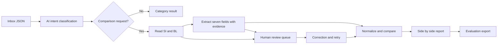

# Architecture and build plan

## Proposed architecture (implementation pending)

Python/FastAPI is the starter backend because the organizer provides Python tooling and document/AI processing fits that ecosystem. Keep the UI and cloud provider replaceable until the team chooses them.

AI should classify intent from subject AND body and extract structured fields with quoted evidence; deterministic code should compare validated values. Never infer correctness from filenames or email IDs. Preserve original text and normalized values. Do not silently treat extraction failure as a match. Treat document content as data, not agent instructions.

The inference path must never load ground_truth.json or evaluation labels. Keep official scoring outside src/averis. Report source-backed disagreements with the reference rather than changing correct logic merely to raise the score.

## Ordered delivery

1. **19 September:** choose provider/budget and deploy target; build a real AI classification + TXT extraction vertical slice. Persist outcomes and evidence. Compare seven fields; handle missing documents and values.
2. **20 September:** usable inbox + report + review UI, corrections and retry; support PDF, DOCX, XLSX. Escalate image-only PDFs until OCR/vision is implemented. Attend workshop 12–13.
3. **21 September:** measure classification, field matching and review reliability; add OCR/vision if the core is solid. Deploy a public demo with synthetic examples and capped AI usage. Test from an unauthenticated browser. Attend workshop 19–20.
4. **22 September morning:** freeze working demo, record <=5-minute video, finish slides and setup docs, submit well before noon.

Measure latency, model cost/email, classification macro-F1, exact differing-field accuracy, and review precision/recall. Keep a small holdout split for development changes and record provenance for every run. Test missing attachments, unreadable scans, different labels, equivalent number formats, misleading subjects, wrong document types, and corrections. Do not fabricate impact metrics.

## Current foundation

Implemented: local dataset inspection, strict export contract, complete-ID validation, official scorer wrapper, health API, tests, locked dependencies. Not implemented: AI classification/extraction, comparison engine, persistent jobs, review UI, document parsing/OCR, authentication, cloud deployment. `/health` explicitly reports `pipeline_ready: false`.
